# Stratum 主架构文档

## 1. 文档目标

本文档是 Stratum 项目的唯一主文档，用于统一策略抽象、系统边界、MVP 范围和技术实现。

它替代此前拆开的“策略修订稿”和“技术架构稿”，避免后续开发出现多份文档并行、边界不一致的问题。

## 2. 系统定位

Stratum 是一个半自动波段交易研究与告警系统，不是自动交易系统。

系统负责：

- 拉取并标准化市场数据
- 识别市场状态
- 识别参与者仓位与杠杆压力
- 在状态和参与者约束下寻找结构触发区域
- 计算风险回报和建议仓位
- 通过语义层做外围过滤和风险解释
- 发送 Telegram 告警
- 记录信号与后续结果

系统不负责：

- 自动下单
- 资金托管
- 高频撮合
- 直接将 LLM 输出映射为执行动作

## 3. 第一性原理下的核心逻辑

Stratum 的核心判断顺序不是“先找图形”，而是：

1. 当前市场处于什么状态
2. 哪类参与者正在主导价格
3. 哪类参与者可能被迫出场或反手
4. 当前价格结构是否提供了低风险位置
5. 当前外部叙事是在强化还是削弱这个机会

因此，系统主链路为：

```text
市场状态识别
-> 参与者压力识别
-> 结构触发识别
-> 风险收益筛选
-> 语义过滤与解释
-> 告警与归因
```

## 3A. 第一性原理的因果推导

本节不是哲学讨论，而是建立从市场微观结构到系统设计决策的因果链。它的作用是：当实现者在边界场景中需要做取舍时，能够回到因果链本身做判断，而不是退回到"找指标 → 出信号"的常规思维。

### 3A.1 价格运动的微观因果

价格的本质是订单簿两侧的力量失衡。每一次价格变动，都是因为买方或卖方中的某一方以市价（market order）主动成交，消耗了对手方的挂单深度（limit order book depth）。

图形——FVG、前高前低、流动性池——只是历史上力量失衡留下的痕迹，不是力量失衡的原因。FVG 之所以存在，是因为过去某一刻买方或卖方的市价单在短时间内耗尽了某个价格区间的流动性，导致价格"跳过"了这个区间。它本身不会"吸引"价格回来——除非有新的参与者在这个区间重新堆积挂单或被迫在这个区间交易。

因此，系统不能从图形出发判断交易机会。图形只是"在哪里可能发生"的线索，而不是"为什么会发生"的原因。

### 3A.2 被迫交易是价格大幅运动的核心驱动

市场中大多数时间的价格波动来自自愿交易——做市商提供流动性，交易者基于观点下单。这些自愿交易通常不会导致价格单方向大幅运动，因为双方都在"选择"自己的执行价格。

价格的大幅单向运动几乎总是由被迫交易（forced execution）驱动：

- **保证金追缴（margin call）**：杠杆交易者的浮亏达到维持保证金线，交易所强制平仓。这类平仓是市价单，直接消耗对手方流动性。
- **止损触发（stop-loss trigger）**：价格突破关键水平，触发大量预设止损单。止损单通常是市价单，集中在同一价格区域的止损触发会形成"止损瀑布"。
- **清算级联（liquidation cascade）**：一批被迫平仓推动价格进一步移动，触发下一批参与者的保证金线，形成连锁反应。

这就是为什么系统必须先判断"谁可能被迫交易"——只有识别了被迫交易的潜在来源，才能预判价格在哪个方向上有"非自愿的推动力"。

### 3A.3 市场状态决定参与者行为的含义

同一个参与者信号在不同市场状态下的含义完全不同：

- **趋势市中的多头拥挤**：如果趋势仍在加速，多头拥挤可能只是追涨，尚不构成即时风险。但一旦趋势出现衰竭迹象，拥挤的多头就成为潜在的被迫平仓来源——因为他们的入场位集中在高位，止损也集中在相近区间。
- **区间市中的多头拥挤**：如果价格在区间上沿附近，拥挤的多头面临区间回归的压力。他们的止损往往在区间下沿附近，一旦触发就可能推动价格穿越整个区间。
- **高波动市中的参与者信号**：波动率放大意味着止损距离也被放大。此时参与者的"拥挤"信号可能是噪音——因为保证金空间足够大，不太会被迫平仓。

这就是为什么状态必须先于参与者判断。不先确定"市场在什么模式下运行"，就无法正确解读参与者行为的后果。

### 3A.4 结构层是"在哪里"而不是"为什么"

一旦系统确定了"什么状态"和"谁可能被迫交易"，结构层的作用就变得清晰：它负责回答"在哪个价格位置，被迫交易最可能发生"。

FVG、前高前低、流动性池之所以有效，不是因为某种神秘的"技术分析规律"，而是因为：

- **FVG** 是历史上流动性缺失的区域，当价格回到这个区域时，之前在这个区间挂单的参与者可能重新参与，形成支撑或阻力。
- **前高前低** 是历史上大量止损单聚集的位置。很多交易者把止损设在前高上方或前低下方，这些止损一旦被触发就是被迫交易。
- **流动性池** 是可预期的止损聚集区域。价格扫过流动性池（sweep）会集中触发止损，产生短暂的极端力量失衡。

因此结构层不应该"决定"交易方向——它只是在参与者层已经给出方向性判断之后，指出"在哪个位置参与风险最低"。这也是为什么系统禁止结构层直接输出最终信号等级。

### 3A.5 LLM 的认识论边界

LLM 的能力来自语料中的统计模式，而非对市场微观结构的因果推理。让 LLM 判断"市场状态"或"参与者压力"，等于用语义相似性替代因果推理——它会给出看起来合理但无法追溯到订单簿层面因果链的答案。

LLM 的正确用法是：在因果链已经完成判断后，利用其语义压缩能力检查"外部叙事是否破坏了判断的前提假设"。例如：

- 系统判断空头拥挤、存在 squeeze-risk → LLM 检查新闻发现 SEC 刚对 BTC ETF 发出否决信号 → 这个外部事件可能强化空头逻辑而削弱 squeeze 概率 → LLM 输出 `downgrade`
- 系统判断多头拥挤、存在 flush-risk → LLM 检查新闻未发现任何相关事件 → LLM 输出 `pass`

LLM 不参与因果链的构建，只参与因果链的外围校验。这条边界不是技术限制，而是认识论约束：因果推理和语义推理是两种不同的认知模式，混用会导致系统退化。

## 4. 核心设计原则

### 4.1 状态优先于结构

结构信号必须建立在可交易的市场状态之上。若当前状态不适合波段结构，则直接不生成候选信号。

为什么状态必须先于一切：市场状态决定了参与者行为的含义。同样的"多头拥挤"信号，在趋势市中可能只是正常追涨（尚不危险），但在区间市上沿附近就意味着回归风险。不先确定状态，参与者压力的方向判断和结构层的位置选择都缺乏有效的解释框架（详见 §3A.3）。

规范化约束：

- `detectStructuralSetups()` 不得在 `regimeConfidence < minRegimeConfidence` 时继续运行
- 若状态层输出低置信度或歧义状态，结构层必须直接返回空数组
- 结构层不得绕过状态层独立生成候选交易

### 4.2 参与者约束优先于图形解释

系统优先解释”谁被迫交易、谁在拥挤、谁可能被挤压”，而不是单纯识别形态。

为什么参与者优先于图形：价格的大幅运动几乎总是由被迫交易驱动——保证金追缴、止损瀑布、清算级联。图形只是历史上力量失衡留下的痕迹，不是失衡的原因。系统必须先回答”谁可能被迫交易”，才能判断图形位置上是否有足够的非自愿推动力（详见 §3A.2）。

### 4.3 结构层只负责位置与失效边界

`FVG`、前高前低、流动性池和高成交量节点都是触发器，不是 alpha 本身。结构层负责给出介入区、止损边界和目标区域。

规范化约束：

- 结构层允许输出：`entryLow`、`entryHigh`、`stopLossHint`、`takeProfitHint`、`structureScore`、`structureReason`、`confluenceFactors`、`confirmationStatus`
- 结构层禁止输出：最终仓位大小、最终信号等级、最终宏观判断
- 结构层不得直接访问 `MacroAssessment`

### 4.3A 复合结构优于单一结构

从第一性原理看，多个独立结构在同一价格区域汇聚（confluence）意味着多重原因同时吸引价格回到该区域。复合结构的成功概率高于单一结构，系统必须识别并量化这种叠加。

规范化约束：

- 结构层必须检测是否存在多种结构类型在同一价格带重叠
- 复合结构只影响 `structureScore` 的评分，不改变入场逻辑或绕过其他层的约束
- 每个 `StructuralSetup` 必须通过 `confluenceFactors` 字段记录参与叠加的结构类型

### 4.3B 入场区域需要确认，不是触碰即触发

价格进入结构区域不等于反转已发生。结构层必须区分"价格到达区域"和"区域内出现拒绝信号"两个阶段。

规范化约束：

- 每个 `StructuralSetup` 必须包含 `confirmationStatus` 字段
- 状态初始值为 `pending`，在 `1h` 确认条件满足后变为 `confirmed`，在失效条件触发后变为 `invalidated`
- 只有 `confirmed` 状态的 setup 才能进入共识层
- `pending` 状态的 setup 可以在告警中以"预警"形式通知，但不参与信号评级

### 4.4 风控是硬门槛

任何叙事和结构，只要风险回报不达标、环境不匹配或参与者逻辑不成立，都不得发出信号。

### 4.5 LLM 只做外围过滤

LLM 的职责是压缩新闻语义、标记事件风险和补充解释，不负责决定交易方向、入场位和仓位大小。

为什么 LLM 只能做过滤：LLM 的推理基于语料统计模式，而非市场微观结构的因果链。让 LLM 判断"市场状态"或"参与者压力"，等于用语义相似性替代因果推理。LLM 的正确角色是：在因果链（状态→参与者→结构→风控）已完成判断后，检查外部叙事是否破坏了判断的前提假设（详见 §3A.5）。

## 5. MVP 范围

第一阶段支持以下能力：

- 标的：`BTC/USDT` 永续
- 交易所：单一交易所，优先 Binance，如受限则切换 Bybit
- 周期：`4h` 主分析，`1h` 辅助确认
- 数据：OHLCV、资金费率、未平仓量、现货价格（用于基差计算）、新闻标题
- 状态识别：趋势、震荡、事件驱动、高波动
- 结构识别：FVG、前高前低、基础流动性池
- 输出渠道：Telegram
- 存储：SQLite

MVP 不包含：

- 自动下单
- 多交易所聚合
- 复杂清算热区数据
- Web 仪表盘
- 高级回测 UI

## 6. 总体架构

系统分为六层。

### 6.1 数据摄取层

输入：

- OHLCV（永续合约）
- 资金费率
- 未平仓量
- 现货价格（用于计算现货-永续基差）
- 新闻标题
- 可选的清算热区或多空比

输出：

- 标准化市场数据
- 标准化参与者数据（含现货-永续基差）
- 标准化新闻数据

### 6.2 市场状态层

职责：判断当前环境是否适合执行某类波段结构。

建议状态：

- `trend`
- `range`
- `event-driven`
- `high-volatility`

MVP 约束：

- `event-driven` 必须能仅依赖价格波动和最近新闻提示完成判定
- 若后续接入经济日历数据，可增强事件前窗口识别，但这不是 MVP 前提

### 6.3 参与者压力层

职责：判断当前是否存在拥挤仓位、杠杆失衡或被迫交易风险。

关键输入：

- 资金费率
- 未平仓量变化
- 价格与 OI 联动关系
- 现货-永续基差（spot-perp basis）
- 可选清算区域

### 6.4 结构触发层

职责：在状态和参与者上下文通过后，识别低风险介入区域。

关键结构：

- FVG
- 前高前低
- 流动性池
- 高成交量节点

### 6.5 风险收益层

职责：评估交易是否值得参与。

关键规则：

- 最小风险回报比
- 状态修正后的止损宽度
- 单笔最大风险
- 同向信号相关性约束

### 6.6 语义过滤层

职责：通过新闻与 LLM 做外围修正。

只负责：

- 强化
- 削弱
- 标记事件风险
- 生成告警摘要

规范化约束：

- 语义层必须输出固定动作：`pass`、`downgrade` 或 `block`
- 语义层只允许降低信号等级或阻断信号，不允许将低等级信号升级为更高等级

## 7. 技术栈

- 运行时：Node.js 20+
- 语言：TypeScript
- 包管理：pnpm 或 npm
- 交易所接入：`ccxt`
- 数据校验：`zod`
- 调度：`node-cron` 或系统 cron
- 存储：SQLite + `better-sqlite3`
- 日志：`pino`
- 测试：`vitest`
- LLM SDK：OpenAI 或兼容 provider SDK

## 8. 项目目录结构

建议目录如下：

```text
Stratum/
  doc/
    stratum-master-architecture.md
  src/
    app/
      config.ts
      env.ts
      logger.ts
      scheduler.ts
    clients/
      exchange/
        ccxt-client.ts
      llm/
        llm-client.ts
      news/
        news-client.ts
      telegram/
        telegram-client.ts
    domain/
      common/
        reason-code.ts
      market/
        candle.ts
        funding-rate.ts
        open-interest.ts
        market-context.ts
      news/
        news-item.ts
      signal/
        structural-setup.ts
        trade-candidate.ts
        alert-payload.ts
      macro/
        macro-assessment.ts
      regime/
        market-regime.ts
        regime-decision.ts
      participants/
        participant-pressure.ts
    services/
      market-data/
        fetch-market-data.ts
        fetch-funding-rates.ts
        fetch-open-interest.ts
      news-data/
        fetch-news.ts
      regime/
        detect-market-regime.ts
      participants/
        assess-participant-pressure.ts
      structure/
        detect-fvg.ts
        detect-liquidity-pools.ts
        detect-confluence.ts
        confirm-entry.ts
        detect-structural-setups.ts
      macro/
        build-macro-prompt.ts
        assess-macro-bias.ts
      consensus/
        build-trade-candidates.ts
        evaluate-consensus.ts
      risk/
        compute-position-size.ts
        compute-risk-reward.ts
      alerts/
        build-alert-message.ts
        dispatch-alert.ts
      journaling/
        record-signal.ts
        record-outcome.ts
    repositories/
      candle-repository.ts
      funding-rate-repository.ts
      open-interest-repository.ts
      news-repository.ts
      signal-repository.ts
      macro-repository.ts
      market-context-repository.ts
    db/
      schema.sql
      migrations/
    workflows/
      run-analysis-cycle.ts
      run-backfill.ts
      run-paper-trade-review.ts
      run-calibration-review.ts
    utils/
      time.ts
      math.ts
      retry.ts
      session.ts
    index.ts
  test/
    unit/
    integration/
    fixtures/
```

## 9. 模块边界

### 9.1 `clients`

对外部系统做最薄封装，只负责请求、响应和错误透传，不写交易逻辑。

### 9.2 `domain`

定义稳定领域模型，不依赖数据库与 SDK，不包含 IO。

### 9.3 `services`

承载核心业务逻辑。状态识别、参与者压力、结构扫描、风控和共识计算都放在这里。

### 9.4 `repositories`

负责存储读写，不承载业务决策。

### 9.5 `workflows`

组合多个服务形成定时任务、批处理和复盘任务。

## 10. 核心数据流

单次分析周期的主路径如下：

1. 拉取 `4h` 和 `1h` K 线
2. 拉取资金费率
3. 拉取未平仓量
4. 拉取现货价格（用于基差计算）
5. 拉取最近 24 小时新闻
6. 识别当前流动性时段
7. 识别市场状态
8. 识别参与者压力（含现货-永续基差）
9. 识别结构触发区域（含复合结构检测和时段修正）
10. 判定入场确认状态
11. 计算风险回报并生成候选交易
12. 用语义层做外围过滤
13. 写入市场上下文和信号快照
14. 发送 Telegram 告警
15. 更新告警分发状态

```mermaid
flowchart TD
  A["OHLCV / Funding / OI / Spot Price"] --> B["Market Regime Engine"]
  A --> C["Participant Pressure Engine\n(含 Spot-Perp Basis)"]
  A --> D["Structure Engine\n(含 Confluence + Session Adj.)"]
  E["News Data"] --> F["LLM Macro Overlay"]
  B --> G["Consensus Engine"]
  C --> G
  D -->|"confirmed only"| G
  G --> H["Risk Engine"]
  F --> H
  H --> I["Alert Dispatcher"]
  H --> J["Signal Journal"]
  J -->|"≥ 50 closed signals"| K["Calibration Review"]
```



## 11. 领域模型

### 11.1 Candle

```ts
export type Candle = {
  timestamp: number;
  open: number;
  high: number;
  low: number;
  close: number;
  volume: number;
};
```

### 11.2 FundingRatePoint

```ts
export type FundingRatePoint = {
  timestamp: number;
  fundingRate: number;
};
```

### 11.3 OpenInterestPoint

```ts
export type OpenInterestPoint = {
  timestamp: number;
  openInterest: number;
};
```

### 11.4 NewsItem

```ts
export type NewsItem = {
  id: string;
  source: string;
  publishedAt: string;
  title: string;
  category: "macro" | "crypto";
  url?: string;
};
```

### 11.5 MarketRegime

```ts
export type MarketRegime =
  | "trend"
  | "range"
  | "event-driven"
  | "high-volatility";
```

### 11.5A ReasonCode

```ts
export type ReasonCode =
  | "REGIME_LOW_CONFIDENCE"
  | "REGIME_AMBIGUOUS"
  | "REGIME_EVENT_DRIVEN"
  | "REGIME_HIGH_VOLATILITY"
  | "REGIME_TREND_EXHAUSTED"
  | "DELEVERAGING_VACUUM"
  | "PARTICIPANT_LONG_CROWDED"
  | "PARTICIPANT_SHORT_CROWDED"
  | "PARTICIPANT_CONFIDENCE_TOO_LOW"
  | "PARTICIPANT_BASIS_DIVERGENCE"
  | "LIQUIDITY_SWEEP_CONFIRMED"
  | "LIQUIDITY_SWEEP_REJECTED"
  | "STRUCTURE_SCORE_TOO_LOW"
  | "STRUCTURE_CONFLUENCE_BOOST"
  | "STRUCTURE_CONFIRMATION_PENDING"
  | "STRUCTURE_CONFIRMATION_INVALIDATED"
  | "RISK_REWARD_TOO_LOW"
  | "CORRELATED_EXPOSURE_LIMIT"
  | "STOP_DISTANCE_TOO_WIDE"
  | "SESSION_LOW_LIQUIDITY_DISCOUNT"
  | "EVENT_WINDOW_WATCH_ONLY"
  | "MACRO_DOWNGRADED"
  | "MACRO_BLOCKED";
```

### 11.6 RegimeDecision

```ts
export type RegimeDecision = {
  regime: MarketRegime;
  confidence: number;
  reasons: string[];
  reasonCodes: ReasonCode[];
};
```

### 11.7 ParticipantPressure

```ts
export type ParticipantPressure = {
  bias: "long-crowded" | "short-crowded" | "balanced";
  pressureType: "squeeze-risk" | "flush-risk" | "none";
  confidence: number;
  rationale: string;
  spotPerpBasis: number;
  basisDivergence: boolean;
  reasonCodes: ReasonCode[];
};
```

### 11.8 MarketContext

```ts
export type MarketContext = {
  regime: MarketRegime;
  regimeConfidence: number;
  regimeReasons: string[];
  participantBias: "long-crowded" | "short-crowded" | "balanced";
  participantPressureType: "squeeze-risk" | "flush-risk" | "none";
  participantConfidence: number;
  participantRationale: string;
  spotPerpBasis: number;
  basisDivergence: boolean;
  liquiditySession: LiquiditySession;
  summary: string;
  reasonCodes: ReasonCode[];
};

export type LiquiditySession =
  | "asian_low"
  | "london_ramp"
  | "london_ny_overlap"
  | "ny_close";
```

### 11.9 StructuralSetup

```ts
export type StructuralSetup = {
  timeframe: "4h" | "1h";
  direction: "long" | "short";
  entryLow: number;
  entryHigh: number;
  stopLossHint: number;
  takeProfitHint: number;
  structureScore: number;
  structureReason: string;
  invalidationReason: string;
  confluenceFactors: ConfluenceFactor[];
  confirmationStatus: "pending" | "confirmed" | "invalidated";
  confirmationTimeframe: "1h";
  reasonCodes: ReasonCode[];
};

export type ConfluenceFactor =
  | "fvg"
  | "swing-high-low"
  | "liquidity-pool"
  | "high-volume-node"
  | "liquidity-sweep";
```

### 11.10 MacroAssessment

```ts
export type MacroAssessment = {
  macroBias: "bullish" | "bearish" | "neutral";
  confidenceScore: number;
  btcRelevance: number;
  catalystSummary: string;
  riskFlags: string[];
  rawPrompt: string;
  rawResponse: string;
};
```

### 11.10A MacroOverlayDecision

```ts
export type MacroOverlayDecision = {
  action: "pass" | "downgrade" | "block";
  confidence: number;
  reason: string;
  reasonCodes: ReasonCode[];
};
```

### 11.11 TradeCandidate

```ts
export type TradeCandidate = {
  symbol: string;
  direction: "long" | "short";
  timeframe: "4h" | "1h";
  entryLow: number;
  entryHigh: number;
  stopLoss: number;
  takeProfit: number;
  riskReward: number;
  regimeAligned: boolean;
  participantAligned: boolean;
  structureReason: string;
  contextReason: string;
  macroReason?: string;
  signalGrade: "watch" | "standard" | "high-conviction";
  reasonCodes: ReasonCode[];
};
```

## 12. 外部接口设计

### 12.1 交易所客户端

```ts
export interface ExchangeClient {
  fetchOHLCV(symbol: string, timeframe: string, limit: number): Promise<Candle[]>;
  fetchFundingRates(symbol: string, limit: number): Promise<FundingRatePoint[]>;
  fetchOpenInterest(symbol: string, limit: number): Promise<OpenInterestPoint[]>;
  fetchTicker(symbol: string): Promise<{ last: number }>;
  fetchSpotTicker(symbol: string): Promise<{ last: number }>;
}
```

### 12.2 新闻客户端

```ts
export interface NewsClient {
  fetchRecentNews(hoursBack: number): Promise<NewsItem[]>;
}
```

### 12.3 LLM 客户端

```ts
export interface LlmClient {
  completeJson(prompt: string): Promise<string>;
}
```

### 12.4 Telegram 客户端

```ts
export interface TelegramClient {
  sendMessage(message: string): Promise<void>;
}
```

## 13. 核心服务接口

### 13.1 市场数据服务

```ts
export async function fetchMarketData(
  symbol: string,
  timeframe: "4h" | "1h",
  limit: number,
): Promise<Candle[]>;
```

### 13.2 市场状态服务

```ts
export function detectMarketRegime(input: {
  primaryCandles: Candle[];
  secondaryCandles: Candle[];
  recentNewsItems?: NewsItem[];
}): RegimeDecision;
```

### 13.3 参与者压力服务

```ts
export function assessParticipantPressure(input: {
  fundingRates: FundingRatePoint[];
  openInterest: OpenInterestPoint[];
  candles: Candle[];
  spotPrice: number;
  perpPrice: number;
}): ParticipantPressure;
```

### 13.4 结构扫描服务

```ts
export function detectStructuralSetups(input: {
  marketContext: MarketContext;
  primaryCandles: Candle[];
  secondaryCandles: Candle[];
  currentPrice: number;
}): StructuralSetup[];
```

### 13.5 宏观评估服务

```ts
export async function assessMacroBias(newsItems: NewsItem[]): Promise<MacroAssessment>;
```

### 13.5A 语义覆盖服务

```ts
export function applyMacroOverlay(input: {
  candidate: TradeCandidate;
  macroAssessment?: MacroAssessment;
}): MacroOverlayDecision;
```

### 13.6 共识评估服务

```ts
export function evaluateConsensus(input: {
  marketContext: MarketContext;
  structuralSetups: StructuralSetup[];
}): TradeCandidate[];
```

### 13.7 风险服务

```ts
export function computePositionSize(input: {
  accountSize: number;
  riskFraction: number;
  entry: number;
  stopLoss: number;
}): number;
```

## 14. LLM 护栏设计

设计原则：

- LLM 只能返回 JSON
- JSON 必须经过 `zod` 校验
- 校验失败自动重试
- 重试失败时允许本轮跳过语义层，但不得让 LLM 阻断整个系统
- 必须保存原始 prompt 和 response 以便审计

建议 Schema：

```ts
import { z } from "zod";

export const MacroAssessmentSchema = z.object({
  macro_bias: z.enum(["bullish", "bearish", "neutral"]),
  confidence_score: z.number().int().min(1).max(10),
  btc_relevance: z.number().int().min(1).max(10),
  catalyst_summary: z.string().min(1),
  risk_flags: z.array(z.string()).default([]),
});
```

### 14.1 Prompt 构造规范

LLM prompt 的内容直接决定了语义层的行为边界。以下规范确保 LLM 只在其认识论能力范围内工作。

#### 必须传入

- 最近 `N` 条新闻标题和摘要（`N` 默认 `10`，由 `maxNewsItemsForPrompt` 配置）
- 当前 BTC 价格和过去 24h 变动百分比
- 候选信号的方向（`long` / `short`）和当前等级（`watch` / `standard` / `high-conviction`）
- 候选信号的简要上下文理由（`contextReason`）

#### 禁止传入

- `structureScore`（LLM 不应评判结构质量，这是因果链内部判断）
- `stopLoss` / `takeProfit` 具体价格（LLM 不应评判位置选择）
- `participantConfidence`（LLM 不应覆盖参与者压力判断）
- `confluenceFactors` 详情（LLM 不应评判结构汇聚）
- 原始 K 线数据或 OI 数据（LLM 不应重新做技术分析）

#### Prompt 必须包含的约束指令

Prompt 中必须显式告知 LLM 以下约束，不得省略：

```text
你的任务是判断最近的新闻和宏观事件是否改变了以下交易方向的前提假设。
你只能输出以下三种动作之一：pass、downgrade、block。
你不能建议新的交易方向、入场位置、止损位置或仓位大小。
你不能将低等级信号提升为更高等级。
如果没有相关新闻或事件，默认输出 pass。
```

### 14.2 block / downgrade / pass 判定标准

语义层的三种输出必须有明确的判定边界，不得由 LLM 自由发挥。

#### block（阻断信号）

以下任一条件满足时，LLM 应输出 `block`：

- 未来 `recentEventWatchWindowHours`（默认 `4`）内有已确认的重大宏观事件（FOMC 利率决议、CPI 公布、非农数据等）
- 突发监管事件直接影响 BTC 的合法性、市场准入或主要交易所运营（如交易所暂停提款、重大监管禁令）
- 新闻揭示了与候选方向直接矛盾的基本面变化，且该变化的规模足以改变短期供需格局（如大型机构公开清算 BTC 持仓）

#### downgrade（降级信号）

以下任一条件满足时，LLM 应输出 `downgrade`：

- 宏观叙事与交易方向存在轻微矛盾，但不构成即时风险（如远期利空但近期无直接催化剂）
- 高影响事件在 `24h` 窗口内但尚未进入即时窗口
- 新闻情绪明显单边倒向候选方向，可能导致追涨/杀跌后的反向清洗（过度一致性风险）
- 候选方向的宏观支撑逻辑正在减弱但尚未反转

#### pass（放行信号）

以下条件满足时，LLM 应输出 `pass`：

- 最近新闻与候选交易方向无关
- 最近新闻与候选交易方向一致，且无过度一致性风险
- 无高影响事件在观察窗口内
- 宏观叙事不改变因果链的前提假设

#### 降级幅度规则

- `downgrade` 将信号降低一级：`high-conviction → standard`，`standard → watch`
- 已经是 `watch` 的信号被 `downgrade` 后仍保持 `watch`，不会被丢弃
- `block` 的信号仍然写入数据库（`alert_status = "blocked_by_macro"`），但不发送告警，确保研究样本不丢失
- `pass` 的信号保持原等级不变，LLM 的 `catalystSummary` 附加到告警文案尾部作为宏观背景参考

### 14.3 LLM 输出与主链路的合并规则

语义层的输出通过 `applyOverlayDecision()` 与主链路合并，具体规则如下：

```ts
function applyOverlayDecision(
  candidate: TradeCandidate,
  overlay: MacroOverlayDecision
): TradeCandidate | null {
  if (overlay.action === "block") {
    // 写入数据库但不发告警
    return { ...candidate, signalGrade: "blocked" as any, macroReason: overlay.reason };
  }

  if (overlay.action === "downgrade") {
    const downgraded = downgradeOneLevel(candidate.signalGrade);
    return {
      ...candidate,
      signalGrade: downgraded,
      macroReason: overlay.reason,
      reasonCodes: [...candidate.reasonCodes, ...overlay.reasonCodes],
    };
  }

  // pass: 保持原等级，附加宏观摘要
  return {
    ...candidate,
    macroReason: overlay.reason,
    reasonCodes: [...candidate.reasonCodes, ...overlay.reasonCodes],
  };
}

function downgradeOneLevel(grade: SignalGrade): SignalGrade {
  if (grade === "high-conviction") return "standard";
  return "watch"; // standard -> watch, watch -> watch
}
```

## 15. 共识与风控规则

### 15.0 风险回报阈值的第一性原理推导

`minimumRiskReward` 不是偏好值，而是基于胜率假设的数学约束。

正期望公式：`期望值 = 胜率 × 平均盈利 - (1 - 胜率) × 平均亏损 > 0`

即：`minimumRR > (1 - winRate) / winRate`

| 假设胜率 | 盈亏平衡 RR | 建议最低 RR（含安全余量） |
|---------|------------|----------------------|
| 45%     | 1.22       | 1.8                  |
| 40%     | 1.50       | 2.0                  |
| 35%     | 1.86       | 2.2                  |
| 30%     | 2.33       | 2.5                  |

MVP 阶段假设系统胜率在 30%~35% 区间（保守估计，新系统未经验证），因此取 `minimumRiskReward = 2.5`。

校准规则：

- 当 `signals` 表中已关闭信号（`hit_stop` / `hit_target` / `expired`）达到 `50` 条后，必须计算实际胜率
- 若实际胜率持续高于 `45%`（连续 3 个月），可考虑将阈值降至 `2.0`
- 若实际胜率低于 `25%`，必须将阈值提高至 `3.0` 并审查信号质量
- 任何阈值调整必须由人工审核后手动修改配置，系统不得自动调整

### 15.1 MVP 建议规则

1. 当前市场状态属于可交易状态
2. 参与者压力逻辑与候选方向不冲突
3. 当前价格进入结构区域附近
4. 风险回报比 `>= 2.5`（推导见 §15.0）
5. 单笔风险固定为总资金的 `1%`，未经验证前不超过 `2%`
6. 若接入 LLM，则 `macroBias` 不与方向强冲突
7. 若 `riskFlags` 命中重大事件，则信号降级或跳过

## 15A. v3 量化判定规则

本节用于把“市场状态”“参与者压力”“跳过交易”从抽象原则细化为可编码规则。

这些规则是 MVP 的初版判定框架，不代表最终最优参数。后续必须通过历史回测和 walk-forward 验证校准阈值。

### 15A.1 市场状态判定规则

市场状态建议基于以下四类输入综合判断：

- `4h` 趋势斜率
- `4h` 与 `1h` 的 ATR 扩张程度
- 最近 `N` 根 K 线区间占比
- 最近新闻中的高优先级事件提示

建议初版定义：

#### `trend`

满足以下大部分条件时判定为 `trend`：

- 最近 `20` 根 `4h` K 线中，收盘价方向一致性明显
- `4h` 结构呈现更高高点更高低点，或更低低点更低高点
- 当前价格距离 `20` 根区间中枢明显偏离，而不是围绕中枢来回穿越
- `ATR(14)` 处于过去 `90` 根样本的中高分位，但未达到事件极端

建议实现为评分制，而不是单条件硬切换。

趋势评分必须包含“衰竭惩罚”，至少覆盖以下情形：

- 当前价格相对 `20` 根 `4h` 中枢或等效均值的偏离超过配置阈值，默认可用 `ATR` 倍数表示
- 连续推动后，最近 `1` 到 `3` 根推动 K 线的实体缩短、影线拉长，显示追价动能减弱
- 价格虽继续创新高或新低，但单位波动所换来的结构推进开始下降

#### `range`

满足以下大部分条件时判定为 `range`：

- 最近 `20` 根 `4h` K 线没有持续方向推进
- 高低点频繁被来回回收
- 当前价格长期围绕局部中值波动
- `ATR(14)` 处于低到中等水平

#### `event-driven`

满足以下任一条件时优先判定为 `event-driven`：

- 最近 `1` 到 `3` 根 `1h` K 线出现异常放量和异常波动，且偏离过去 `30` 根均值明显
- 最近新闻中出现高优先级风险事件，且价格已出现快速重估
- 若后续接入经济日历数据，则未来事件窗口可作为额外加分项，但不是 MVP 依赖

#### `high-volatility`

满足以下大部分条件时判定为 `high-volatility`：

- `1h ATR(14)` 显著高于过去 `30` 到 `90` 根样本中位水平
- 最近 `3` 根 `1h` K 线的平均实体或总振幅异常放大
- 多个结构区域被连续快速穿透，价格缺乏稳定承接

### 15A.1A 交易时段流动性修正

BTC 永续合约的流动性在全球三个交易时段有显著差异。同一个结构信号在不同时段出现，其可信度和虚假突破风险完全不同。

系统必须识别当前分析周期所处的流动性时段：

| 时段标签 | UTC 时间范围 | 流动性特征 |
|---------|------------|----------|
| `asian_low` | UTC 22:00 ~ UTC 06:00 | 流动性最低，虚假突破比例高，小额资金可操纵价格 |
| `london_ramp` | UTC 06:00 ~ UTC 08:00 | 流动性快速上升，大量止损被触发，sweep 最集中 |
| `london_ny_overlap` | UTC 08:00 ~ UTC 16:00 | 流动性最高，趋势加速或大幅反转概率最高 |
| `ny_close` | UTC 16:00 ~ UTC 22:00 | 流动性递减，方向性减弱 |

修正规则：

- 在 `asian_low` 时段产生的结构触发，`structureScore` 乘以 `sessionDiscountFactor`（默认 `0.8`）
- 在 `london_ramp` 时段产生的流动性 sweep，`structureScore` 乘以 `sessionPremiumFactor`（默认 `1.1`）
- `london_ny_overlap` 为基准时段，不做修正（乘以 `1.0`）
- `ny_close` 时段不做修正（乘以 `1.0`）
- 修正后 `structureScore` 上限不超过 `100`，下限不低于 `0`

时段修正只影响 `structureScore`，不改变 regime 判定或参与者压力判定。

当 `enableSessionAdjustment = false` 时，所有时段修正系数强制为 `1.0`。

### 15A.2 市场状态评分建议

建议不要直接用布尔判断，而是给每个状态计算 `0-100` 分，然后选取最高分状态。

例如：

```ts
type RegimeScore = {
  trend: number;
  range: number;
  eventDriven: number;
  highVolatility: number;
};
```

最终输出：

```ts
type RegimeDecision = {
  regime: "trend" | "range" | "event-driven" | "high-volatility";
  confidence: number;
  reasons: string[];
};
```

最终状态选择必须遵守以下顺序：

1. 若 `eventDriven >= eventDrivenOverrideScore`，优先输出 `event-driven`
2. 否则若 `highVolatility >= highVolatilityOverrideScore`，优先输出 `high-volatility`
3. 否则在 `trend` 与 `range` 中选择高分者
4. 若最高分与次高分差值低于 `minRegimeScoreGap`，则输出最高分状态但必须降低 `confidence`，并附加 `REGIME_AMBIGUOUS`

### 15A.3 参与者压力判定规则

参与者压力建议基于以下联合关系判断：

- 资金费率绝对水平
- 资金费率变化速度
- 未平仓量变化率
- 价格方向与 OI 变化的关系

核心判断逻辑：

#### 多头拥挤

当出现以下组合时，倾向判定为 `long-crowded`：

- 资金费率持续偏正且升高
- 价格上涨同时 OI 上升
- 上涨主要由合约扩张驱动而非回补驱动

这通常意味着多头追价加杠杆，后续存在 `flush-risk`。

#### 空头拥挤

当出现以下组合时，倾向判定为 `short-crowded`：

- 资金费率持续偏负且走低
- 价格下跌同时 OI 上升
- 下跌主要由空头扩张驱动

这通常意味着空头追空加杠杆，后续存在 `squeeze-risk`。

#### 去杠杆而非新开仓

若价格上涨但 OI 下降，可能更接近空头回补。

若价格下跌但 OI 下降，可能更接近多头平仓。

这两类情形都应与“趋势继续扩张”区分开，避免误把去杠杆行情当作新趋势追逐。

#### 极端去杠杆真空

若在 `1h` 内 OI 的绝对降幅超过配置阈值，默认建议阈值为 `10%`，则应优先视为“燃料已被引爆后的真空期”。

在该情形下，默认处理为：

- `pressureType` 输出为 `none`
- `bias` 优先输出为 `balanced`
- `confidence` 下调，且不作为新的波段推动依据
- 共识层默认跳过，除非后续重新形成新的结构与参与者压力

建议实现中显式保留真空标记，例如通过 `rationale` 或单独 helper 判断，而不是把所有 `pressureType: "none"` 都等价处理。

#### 现货-永续基差背离

资金费率和 OI 只反映合约端的单边信息。现货价格与永续合约价格的背离提供了合约端和现货端参与者行为不一致的关键信号。

基差定义：`spotPerpBasis = (spotPrice - perpPrice) / spotPrice`

| 基差方向 | Funding Rate | 含义 | 压力修正 |
|---------|-------------|------|---------|
| 正值（现货溢价） | 持续负值 | 空头在合约端聚集，但现货买方仍强 | `squeeze-risk` 评分上调 |
| 负值（期货溢价） | 持续正值 | 多头通过合约杠杆追价，现货端缺乏支撑 | `flush-risk` 评分上调 |
| 正值（现货溢价） | 持续正值 | 双端一致看多，暂无背离 | 不修正 |
| 负值（期货溢价） | 持续负值 | 双端一致看空，暂无背离 | 不修正 |

判定规则：

- 当 `|spotPerpBasis| >= basisDivergenceThreshold`（默认 `0.002`，即 `0.2%`）且基差方向与 funding rate 方向相反时，标记 `basisDivergence = true`
- `basisDivergence = true` 时，对应方向的 `pressureType` 置信度上调（建议加 `10~15` 分）
- 必须附加 `PARTICIPANT_BASIS_DIVERGENCE` reason code

MVP 约束：

- 若交易所 API 不支持独立的现货 ticker，可使用同交易所现货交易对的 `fetchTicker` 替代
- 若现货数据暂时不可用，`spotPerpBasis` 默认为 `0`，`basisDivergence` 默认为 `false`，不影响主流程

### 15A.4 参与者压力评分建议

建议输出不只包含标签，还包含置信度和解释字段。

```ts
type ParticipantPressure = {
  bias: "long-crowded" | "short-crowded" | "balanced";
  pressureType: "squeeze-risk" | "flush-risk" | "none";
  confidence: number;
  rationale: string;
  spotPerpBasis: number;
  basisDivergence: boolean;
  reasonCodes: ReasonCode[];
};
```

评分建议：

- `confidence < 50` 视为弱判断
- `50-70` 视为中等判断
- `> 70` 视为可用于主路径过滤

### 15A.5 结构触发规则细化

结构层只在以下前提下运行：

- 当前 `regime` 可交易
- `participantPressure` 未与候选方向强冲突
- `regimeConfidence >= minRegimeConfidence`
- 非 `DELEVERAGING_VACUUM`

建议的结构触发条件：

#### 做多候选

- 高周期状态不为明显震荡破坏
- 当前价格回到有效折价结构区域
- 结构区域下方存在明确失效点
- 下一流动性目标与入场区形成足够风险回报

#### 做空候选

- 高周期状态不为明显逼空环境
- 当前价格回到有效溢价结构区域
- 结构区域上方存在明确失效点
- 下一流动性目标与入场区形成足够风险回报

#### 流动性池 Sweep 确认

对于基于前高前低流动性池的 setup，单纯“触价”不构成有效触发，必须加入收盘确认。

做多方向默认规则：

- 价格可以短暂刺破前低或流动性池下沿
- 但触发 K 线必须在 `4h` 收盘时重新收回该水平之上
- 若仅在盘中触及但未收回，则不得判定为有效 sweep

做空方向默认规则：

- 价格可以短暂刺破前高或流动性池上沿
- 但触发 K 线必须在 `4h` 收盘时重新收回该水平之下
- 若仅在盘中触及但未收回，则不得判定为有效 sweep

说明：

- FVG 回踩与流动性猎杀是两种不同结构，不应使用同一触发条件
- 对于基于流动性池的入场，默认禁止“首次触碰即入场”

#### 复合结构（Confluence）加分规则

当多个独立结构类型在同一价格区域重叠时，构成复合结构。

判定条件：

- 两个或以上不同类型的结构（FVG、前高前低、流动性池、高成交量节点）的有效区域在价格空间上存在交集
- "有效区域"定义为：该结构的 `entryLow` 到 `entryHigh` 范围
- 交集判定：两个结构的入场区域存在任何重叠即视为 confluence

加分规则：

- 2 种结构叠加：`structureScore` 加 `confluenceBonus`（默认 `10` 分）
- 3 种及以上结构叠加：`structureScore` 加 `confluenceBonus × 1.5`（默认 `15` 分）
- 流动性被扫荡后在同区域留下新 FVG：视为最高优先级 confluence，加 `confluenceBonus × 2`（默认 `20` 分）

加分后 `structureScore` 上限仍为 `100`。

每个 `StructuralSetup` 的 `confluenceFactors` 必须记录参与叠加的所有结构类型。当 `confluenceFactors.length >= 2` 时，附加 `STRUCTURE_CONFLUENCE_BOOST` reason code。

#### 入场区域确认机制

价格到达结构区域后，必须出现"拒绝信号"才能确认该区域有效。系统不允许"触碰即触发"。

做多方向确认条件（在 `1h` 周期上判定）：

- 价格进入 `entryLow ~ entryHigh` 区域后，需要至少一根 `1h` K 线满足以下任一条件：
  - 收盘价高于 `entryLow`，且下影线占总振幅比例 `>= confirmationShadowRatio`（默认 `0.5`）
  - 连续 `confirmationCandles`（默认 `2`）根 `1h` K 线的低点不再创新低

做空方向确认条件：

- 对称逻辑：收盘价低于 `entryHigh`，且上影线占总振幅比例 `>= confirmationShadowRatio`
- 或连续 `confirmationCandles` 根 `1h` K 线的高点不再创新高

确认失效条件：

- 做多方向：若 `1h` 收盘价低于 `stopLossHint`，则 `confirmationStatus` 变为 `invalidated`
- 做空方向：若 `1h` 收盘价高于 `stopLossHint`，则 `confirmationStatus` 变为 `invalidated`
- 已 `invalidated` 的 setup 不再重复触发，需等待新的结构形成

共识层约束：

- 只有 `confirmationStatus === "confirmed"` 的 setup 才能进入共识层
- `confirmationStatus === "pending"` 的 setup 可以在告警中以"预警"形式推送，但 `signalGrade` 不得高于 `watch`
- `confirmationStatus === "invalidated"` 的 setup 直接丢弃

结构层的最低规范：

- 每个 `StructuralSetup` 必须产出 `structureScore`
- 若 `structureScore < minStructureScore`，则不得进入共识层
- 当 `participantConfidence` 不足但仍允许保留观察级别机会时，必须满足 `structureScore >= minStructureScoreForWeakParticipantOverride`

### 15A.6 跳过交易规则

系统必须把“跳过”作为正常输出，而不是异常情况。

以下情况建议直接不发信号：

1. `regimeConfidence` 低于最小阈值
2. `participantPressure.confidence` 低于最小阈值，且结构优势不明显
3. 最近 `1h` OI 绝对降幅超过真空阈值，表明去杠杆刚刚完成且燃料耗尽
4. 当前属于 `event-driven` 且仍在高影响事件窗口内
5. 当前属于 `high-volatility` 且止损宽度超出策略容忍范围
6. 结构区域已被价格深度穿透，失去“低风险入场”意义
7. 风险回报比低于 `2.5`
8. 连续出现同方向高度相关信号，导致组合暴露过高
9. LLM 风险标记命中高优先级风险，且方向未得到结构与参与者层共同支持

其中以下模糊条件必须配置化，不得由实现者自由解释：

- “结构优势不明显” 对应 `structureScore < minStructureScoreForWeakParticipantOverride`
- “止损宽度超出策略容忍范围” 对应 `stopDistanceAtr > maxStopDistanceAtr`
- “同方向高度相关信号过多” 对应 `sameDirectionOpenSignals > maxCorrelatedSignalsPerDirection`

### 15A.7 降级而非跳过的规则

以下情况可以发“观察级别”信号，而不是标准信号：

- 结构很好，但参与者压力不够明确
- 参与者压力明确，但结构位置尚未理想
- 市场状态可交易，但接近事件窗口

建议将候选信号分级为：

```ts
type SignalGrade = "watch" | "standard" | "high-conviction";
```

降级规则必须配置化：

- 若 `participantConfidence < minParticipantConfidence` 但 `structureScore >= minStructureScoreForWeakParticipantOverride`，则最高只能输出 `watch`
- 若命中最近事件窗口，且 `hoursSinceHighPriorityEvent <= recentEventWatchWindowHours`，则最高只能输出 `watch`
- 语义层只能将信号从 `high-conviction -> standard -> watch` 逐级下调，不能反向提升

### 15A.8 共识引擎伪逻辑

```ts
if (regime.confidence < config.minRegimeConfidence) return [];

if (regime.regime === "event-driven" && !config.allowEventDrivenSignals) {
  return [];
}

const pressure = assessParticipantPressure(input);

if (isDeleveragingVacuum(pressure, config)) {
  return [];
}

const marketContext = buildMarketContext(regime, pressure);
const setups = detectStructuralSetups({ ...input, marketContext })
  .filter((setup) => setup.structureScore >= config.minStructureScore)
  .filter((setup) => setup.confirmationStatus !== "invalidated");

// confirmationStatus === "pending" 的 setup 只能输出 watch 等级
const confirmedSetups = setups.filter((setup) => setup.confirmationStatus === "confirmed");
const pendingSetups = setups.filter((setup) => setup.confirmationStatus === "pending");

const candidates = confirmedSetups
  .map((setup) => combineSetupWithContext(setup, marketContext))
  .filter((candidate) => candidate.regimeAligned)
  .filter((candidate) => candidate.participantAligned)
  .filter((candidate) => candidate.riskReward >= config.minimumRiskReward);

// pending setups 强制降级为 watch
const watchCandidates = pendingSetups
  .map((setup) => combineSetupWithContext(setup, marketContext))
  .filter((candidate) => candidate.regimeAligned)
  .filter((candidate) => candidate.participantAligned)
  .filter((candidate) => candidate.riskReward >= config.minimumRiskReward)
  .map((candidate) => ({ ...candidate, grade: "watch" as const }));

const allCandidates = [...candidates, ...watchCandidates];

return allCandidates
  .map((candidate) => ({ candidate, overlay: applyMacroOverlay({ candidate, macroAssessment }) }))
  .filter(({ overlay }) => overlay.action !== "block")
  .map(({ candidate, overlay }) => applyOverlayDecision(candidate, overlay));
```

## 16. 配置设计

环境变量建议：

```text
EXCHANGE_NAME=binance
SYMBOL=BTC/USDT:USDT
NEWS_API_KEY=
LLM_API_KEY=
TELEGRAM_BOT_TOKEN=
TELEGRAM_CHAT_ID=
DATABASE_URL=./stratum.db
ACCOUNT_SIZE=10000
RISK_PER_TRADE=0.01
```

静态配置建议：

```ts
export const strategyConfig = {
  // --- 周期与数据 ---
  primaryTimeframe: "4h",
  secondaryTimeframe: "1h",
  marketDataLimit: 500,

  // --- 风险回报（推导见 §15.0）---
  minimumRiskReward: 2.5,
  riskPerTrade: 0.01,

  // --- 市场状态 ---
  minRegimeConfidence: 60,
  eventDrivenOverrideScore: 80,
  highVolatilityOverrideScore: 75,
  minRegimeScoreGap: 10,
  trendExtensionAtrPenaltyThreshold: 2.0,

  // --- 参与者压力 ---
  minParticipantConfidence: 60,
  oiCollapseVacuumThresholdPercent: 0.1,
  basisDivergenceThreshold: 0.002,
  basisDivergenceConfidenceBoost: 12,

  // --- 结构触发 ---
  liquiditySweepConfirmationTimeframe: "4h",
  minStructureScore: 60,
  minStructureScoreForWeakParticipantOverride: 75,
  confluenceBonus: 10,
  confirmationShadowRatio: 0.5,
  confirmationCandles: 2,

  // --- 交易时段 ---
  enableSessionAdjustment: true,
  sessionDiscountFactor: 0.8,
  sessionPremiumFactor: 1.1,

  // --- 风控门槛 ---
  maxStopDistanceAtr: 2.5,
  maxCorrelatedSignalsPerDirection: 2,

  // --- 事件与语义 ---
  recentEventWatchWindowHours: 12,
  minimumMacroConfidence: 7,
  minimumBtcRelevance: 6,
  allowEventDrivenSignals: false,
  maxNewsItemsForPrompt: 10,

  // --- 校准 ---
  calibrationMinSampleSize: 50,
};
```

## 17. 数据库设计

SQLite MVP 建议表：

### 17.1 `candles`

- `symbol`
- `timeframe`
- `timestamp`
- `open`
- `high`
- `low`
- `close`
- `volume`

### 17.2 `funding_rate_points`

- `symbol`
- `timestamp`
- `funding_rate`

### 17.3 `open_interest_points`

- `symbol`
- `timestamp`
- `open_interest`

### 17.4 `news_items`

- `id`
- `source`
- `published_at`
- `title`
- `category`
- `url`

### 17.5 `macro_assessments`

- `id`
- `created_at`
- `macro_bias`
- `confidence_score`
- `btc_relevance`
- `catalyst_summary`
- `risk_flags_json`
- `raw_prompt`
- `raw_response`

### 17.6 `market_contexts`

- `id`
- `created_at`
- `regime`
- `regime_confidence`
- `regime_reasons_json`
- `participant_bias`
- `participant_pressure_type`
- `participant_confidence`
- `participant_rationale`
- `spot_perp_basis`
- `basis_divergence`
- `liquidity_session`
- `summary`
- `reason_codes_json`

### 17.7 `signals`

- `id`
- `created_at`
- `symbol`
- `direction`
- `timeframe`
- `entry_low`
- `entry_high`
- `stop_loss`
- `take_profit`
- `risk_reward`
- `structure_score`
- `structure_reason`
- `confluence_factors_json`
- `confirmation_status`
- `context_reason`
- `macro_reason`
- `signal_grade`
- `reason_codes_json`
- `market_context_id`
- `macro_assessment_id`
- `alert_status`
- `alert_sent_at`
- `alert_error`
- `status`

`status` 可取：

- `triggered`
- `expired`
- `hit_stop`
- `hit_target`
- `invalidated`

## 18. 工作流设计

### 18.1 主分析周期

`runAnalysisCycle()` 步骤：

1. 读取配置
2. 拉取 `4h` 和 `1h` K 线
3. 拉取资金费率
4. 拉取未平仓量
5. 拉取现货价格（用于基差计算）
6. 拉取最近 24 小时新闻
7. 识别当前流动性时段
8. 识别市场状态
9. 识别参与者压力（含现货-永续基差）
10. 识别结构触发区域（含复合结构检测和时段修正）
11. 判定入场确认状态
12. 计算风险回报并生成候选交易
13. 用语义层做外围过滤
14. 写入市场上下文和信号快照
15. 发送 Telegram 告警
16. 更新告警分发状态

### 18.2 历史回填

`runBackfill()` 用于初始化历史样本和 K 线数据。

### 18.3 纸面交易复盘

`runPaperTradeReview()` 用于扫描已触发信号并根据后续价格表现标记结果。

### 18.4 参数校准工作流

`runCalibrationReview()` 用于基于已关闭信号的历史表现，生成阈值校准建议。

触发条件：

- `signals` 表中 `status` 为 `hit_stop` / `hit_target` / `expired` 的记录数量 `>= calibrationMinSampleSize`（默认 `50`）

校准维度（MVP）：

1. **胜率校准**：计算整体实际胜率 → 输出 `minimumRiskReward` 调整建议
2. **按 regime 分组统计**：每种市场状态下的胜率和平均 RR → 识别哪种状态下系统表现最差
3. **按 structureScore 分桶统计**：验证 `minStructureScore` 阈值是否合理
4. **按时段分组统计**：验证 `sessionDiscountFactor` 和 `sessionPremiumFactor` 是否需要调整
5. **按 confluenceFactors 分组统计**：验证复合结构是否确实比单一结构表现更好

输出：

- 校准报告（JSON 格式），包含每个维度的统计结果和调整建议
- 通过 Telegram 发送校准摘要
- 校准报告写入数据库 `calibration_reports` 表

禁止：

- 系统不得自动修改 `strategyConfig` 中的任何配置项
- 校准结果只作为人工审核参考，最终决策权在人
- 样本量不足时不得输出校准建议，只输出"样本不足"状态

## 19. 测试策略

单元测试必须覆盖：

- 市场状态识别
- 参与者压力判断（含现货-永续基差背离场景）
- FVG 与结构检测
- 复合结构（confluence）检测与评分
- 入场确认机制（confirmed / pending / invalidated 三种状态）
- 交易时段流动性修正
- 风险回报计算
- 仓位计算
- 共识纯函数
- `zod` Schema 校验

集成测试建议覆盖：

- `ccxt` 到标准化数据转换（含现货 ticker）
- LLM JSON 解析流程
- Telegram 消息构建流程

## 20. 可观测性与错误处理

每次分析周期至少记录：

- 开始和结束时间
- 外部 API 成功或失败情况
- 当前状态识别结果
- 当前参与者压力结果
- 结构候选数量
- LLM 是否通过校验
- 最终告警数量

错误处理原则：

- 外部 API 失败时有限重试
- 单模块失败不导致整个进程崩溃
- Telegram 发送失败时先落库后补发
- LLM 失败时跳过语义层但保留主流程

## 21. 实施顺序

建议按以下顺序开发：

1. 建立 TypeScript 项目骨架
2. 接通 OHLCV、funding rate、open interest
3. 实现市场状态识别
4. 实现参与者压力分析
5. 实现结构触发识别
6. 实现风险与告警逻辑
7. 最后接入 LLM 语义过滤

## 22. 最终结论

Stratum 的核心不是”用 AI 看新闻 + 用 FVG 找位置”，而是”先判断环境和参与者约束，再用结构寻找低风险介入点，最后用语义层做外围过滤”。

第一性原理要求系统在每一层都回答一个底层问题：

1. **市场状态层**：当前环境允许什么类型的操作？
2. **参与者压力层**：谁在被迫交易？现货和合约市场是否一致？
3. **结构触发层**：多重结构是否在同一区域汇聚？价格是否已在该区域表现出拒绝？
4. **风险收益层**：基于当前胜率假设，这笔交易的数学期望是否为正？
5. **语义过滤层**：外部叙事是否改变了以上判断的前提？
6. **校准闭环**：系统过去的表现是否支持当前的阈值设定？

只要后续实现始终保持这个顺序和闭环，Stratum 就会更接近第一性原理波段交易系统，而不是停留在技术形态驱动的交易工具层面。

如何判断系统在实际运行中是否真正做到了以上原则，参见 [EVALUATION_CRITERIA.md](./EVALUATION_CRITERIA.md)——它定义了开发、测试和运行三个阶段的十六个评判问题和十条红线规则。
